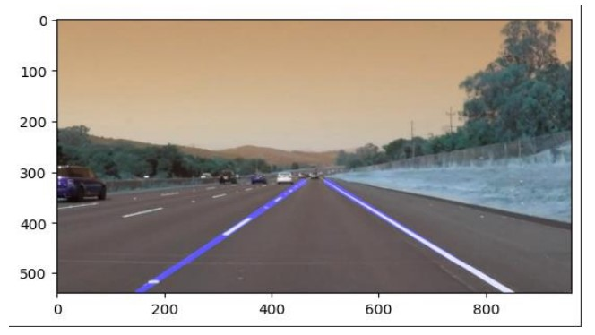

# Automated Lane Detection in Road Images using Computer Vision 

This project aims to detect and highlight lane lines in images, primarily targeting road scenes. It utilizes computer vision techniques to process images, detect edges, isolate relevant regions of interest, and extrapolate lane lines for better visualization.

## Project Abstract
 
Lane detection is a crucial aspect of autonomous driving systems and assists in lane departure warnings, lane-keeping assistance, and overall navigation. 

This project implements a lane detection algorithm using Python and OpenCV, leveraging image processing techniques such as edge detection, region masking, and line extrapolation via Hough transform. The pipeline includes steps to convert images to grayscale, apply Gaussian blur for noise reduction, detect edges using the Canny edge detector, isolate the region of interest, identify lines via Hough transform, and finally overlay the detected lanes onto the original image.

## Software Dependencies

* **OpenCV**: OpenCV (Open Source Computer Vision Library) is a crucial library for computer vision tasks, providing various functions for image processing, feature detection, and more.
* **NumPy**: NumPy is used for numerical computations, especially in handling arrays and mathematical operations.
* **Matplotlib**: Matplotlib is employed for visualizing images and results within the Python environment.
* **Python**: The project is developed in Python, leveraging its simplicity and extensive libraries for image processing and manipulation.
## Features

### Image Preprocessing:

* Grayscale Conversion: Conversion of the input image to grayscale to simplify lane line detection.
* Gaussian Blur: Reducing noise in the image using a Gaussian blur to enhance edge detection.

### Edge Detection:

* Canny Edge Detection: Identifying edges within the image to highlight potential lane lines.

### Region of Interest Extraction:

* Masking: Isolating the region of interest within the image (the road area) for focused lane detection.

### Lane Line Detection:

* Hough Transform: Detecting lines within the region of interest to identify potential lane lines.
* Line Averaging and Extrapolation: Calculating average lines from detected line segments and extrapolating them to cover the full extent of the lane.

### Visualization:

* Overlaying: Combining the detected lane lines with the original image for visual representation.

### Compatibility:

* Works with static images for lane detection and visualization purposes.

## Steps to Build

1. **Environment Setup**:
* Install Python and necessary libraries: OpenCV, NumPy, Matplotlib.

2. **Collect Input Images**:
* Gather road images for testing and development purposes.

3. **Image Processing Pipeline**:
* Convert images to grayscale and apply Gaussian blur to reduce noise.
* Utilize Canny edge detection to identify edges in the blurred image.
* Define a region of interest (ROI) and mask the edges to focus on the road area.
4. **Lane Detection Algorithm**:
* Implement Hough transform to detect lines in the ROI.
* Calculate average lines from detected line segments and extrapolate for complete lane coverage.
5. **Overlay Results**:
* Combine detected lane lines with the original image for visualization.
6. **Testing and Refinement**:
* Test the pipeline with various road images for accuracy.
* Fine-tune parameters for optimal performance under different conditions.

By following these steps, you can develop a robust lane detection system capable of identifying and visualizing lane markings in road images using Python and OpenCV.
